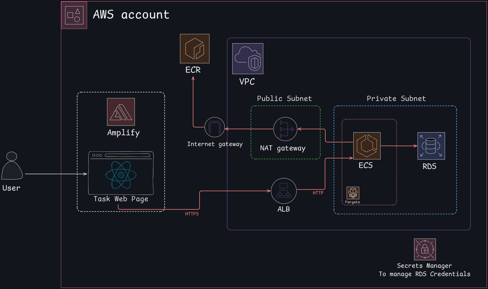

# Blossom Application Deployment From Scratch & Architecture Documentation

## 🗂️ Table of Contents

1. [Overview](#overview)

2. [Architecture Diagram](#architecture-diagram)

3. [Deployment Guide](#deployment-guide)

4. [Test the APP](#test-the-app)

5. [Security Measures](#security-measures)

6. [Scaling the Application](#scaling-the-application)

7. [Monitoring & Logging](#monitoring--logging)


## Overview

The **Blossom Deployment Test** application is composed of a containerized Node.js REST API deployed on AWS using **ECS Fargate**, alongside a Single Page Application (SPA) hosted on **AWS Amplify**. It integrates with a **PostgreSQL database** hosted on **Amazon RDS**, enabling robust and scalable data storage. 

The architecture is designed following **AWS best practices**, incorporating **public and private subnets**, **security groups**, and **NAT gateways** to establish a secure and well-isolated networking environment. Additionally, the use of **GitHub Actions** enables automated deployments, making it easy to replicate the infrastructure across environments and apply updates with minimal effort.

The deployed application is accessible via the following URL:

- http://frontend-app-5eec9674.s3-website-us-east-1.amazonaws.com

> A detailed explanation of why the app is currently hosted on S3 instead of Amplify will be provided later in this documentation.

## Architecture Diagram



The Blossom Deployment Test application is deployed in a secure and scalable AWS environment, as illustrated in the diagram. The architecture is designed with a strong focus on network segmentation, security, and high availability. Below is a breakdown of each component and how networking is configured to support them:

### Networking

All networking infrastructure is defined in the `template-networking.yml` file, which manages the creation and configuration of the **VPC**, **public and private subnets**, **gateways**, and **security groups** to ensure secure and organized network segmentation.

The **Virtual Private Cloud (VPC)**. It is divided into:

- **Public Subnets**:  Used for internet-facing components: **Application Load Balancer (ALB)** and **NAT Gateway**. These subnets are configured to assign public IPs and have routes through the **Internet Gateway**.

- **Private Subnets**:  Reserved for internal services such as the **ECS Fargate tasks** (which host the Node.js API) and the **Amazon RDS PostgreSQL instance**. These subnets **do not have direct access to the internet**, enhancing security.

The **Security Groups** Security groups act as virtual firewalls that control inbound and outbound traffic to AWS resources, in this application 3 security groups are configured: 

- **ALB Security Group**: Allows **HTTP/HTTPS (ports 80/443)** from the internet (0.0.0.0/0) to the ALB.

- **ECS Security Group** : Allows inbound traffic **only from the ALB's security group on port 4000**, which is the port the API listens on. And allows outbound traffic to the RDS PostgreSQL port (5432).

- **RDS Security Group**  Only allows inbound traffic **from the ECS Security Group on port 5432**, restricting DB access to ECS tasks exclusively. This ensures **zero direct access** to the database from the internet or other public interfaces.

The **NAT Gateway** in the public subnet, enables **ECS tasks running in private subnets** to initiate outbound internet connections, essential for operations like **pulling container images from Amazon ECR**, without exposing those services to inbound internet traffic.

The **Internet Gateway** provides the public subnets with direct internet access.

### Security Best Practices Followed

- **Least privilege**: Only required ports and sources are allowed in security groups.

- **Private DB subnet**: RDS is only accessible from ECS, not from the public internet.

- **Outbound access through NAT**: ECS can reach external services without being exposed.

- **Amplify isolation**: The frontend is fully decoupled and lives outside the VPC.

## Deployment Guide

### Prerequisites

- AWS Account

- AWS CLI configured

- Docker installed

- GitHub account

### Steps

#### 1. Set up an AWS account from scratch

The first step is to create a **root user account** on AWS to gain access to the AWS Management Console. Once the root account is set up, the next step is to create an **administrator IAM user**. This user will have the necessary permissions to manage all AWS services without exposing the root credentials.

After creating the admin user, generate an **access key** for it. This key will be used locally to interact with AWS services via the CLI, which is essential for tasks like deploying the first container image to **Amazon ECR (Elastic Container Registry)**.

The policies added to this user will be the AdministratorAccess AWS managed policy.

#### 2. Create an Identity Provider for GitHub Actions Deployments

In the **IAM** section of the AWS Console, we create an **Identity Provider** using **OpenID Connect (OIDC)**, pointing to `token.actions.githubusercontent.com`. This setup enables secure authentication from GitHub Actions workflows.

Next, we create an **IAM role** that grants the necessary permissions to deploy the application. The role is configured with the policies defined in the `iam/GithubActionsRole.json` file.

To enhance security, we also define a **trust relationship** that ensures **only a specific GitHub repository** can assume this role. This prevents unauthorized access and guarantees that the permissions assigned to this role are used exclusively during the deployment process triggered by GitHub Actions.


#### 3. Amplify deployment

The frontend application was recently migrated from **Create React App** to **Vite** to take advantage of Vite’s faster build times and more efficient deployment process.

To deploy the frontend using **AWS Amplify**, navigate to the Amplify Console and connect your **GitHub repository** by following the guided setup process.

Since the project is currently structured as a **monorepo**, you’ll need to specify the `test-app` directory in the **Monorepo root directory** field during the repository setup. Also, set the **build command** to: `npm run build`

Additionally, configure the **environment variables** needed for the application to communicate with the **Application Load Balancer (ALB)**. The URL_API can be retrieved after deploying the infrastructure, so in the future is necessary to redeploy to change the env variable.

If everything is configured correctly, you should see a confirmation screen similar to the one below:


#### 4. Infrastructure deployment

To provision the infrastructure, we opted for an **Infrastructure as Code (IaC)** approach using **AWS CloudFormation**. Inside the `infrastructure` folder, you will find the pre-configured CloudFormation templates that define all required resources for the application.

These templates are modularized into **nested stacks**, allowing each part of the infrastructure (networking, compute, database, etc.) to be managed independently. This structure makes it easier to **deploy, update, or maintain specific components** without affecting the entire system.

The **GitHub Actions pipeline** is set up to automate the deployment process. It handles both the **provisioning of AWS resources** and the **build and push of container images** to Amazon ECR.

> ⚠️ Before running the pipeline, make sure to update the **environment variables** according to your AWS account setup:

- `PROD_PIPELINE_EXECUTION_ROLE`: This refers to the IAM role previously created for OIDC-based GitHub deployments.

- `STACK_TEMPLATES_BUCKET`: This should point to an existing **S3 bucket** in your account where the CloudFormation templates will be uploaded. If the bucket doesn't exist yet, you'll need to create it manually via the AWS Console and assign its name to this variable.

During the **first deployment**, you will need to **pause** once the **ECS stack reaches a "waiting" state** at the `ECSService` resource. At this point, you must manually **push the application image** to the newly created ECR repository.

To do this, go to the **AWS Console**, navigate to **ECR**, and open the repository that was created by the CloudFormation stack. There, you'll find detailed instructions for uploading a Docker image from your local machine.

> ⚠️ This step requires that the **AWS CLI is already configured locally**, which is why it was necessary to set that up earlier.

Once the image is successfully pushed, the deployment process will continue automatically and complete the ECS service setup.

Once the all stacks runs successfully, you should see a stack in your AWS CloudFormation Console that looks like this:


## Test the App

To verify the deployment, you can access both the **backend** and **frontend** components of the application through their respective endpoints.

#### 🖥️ Backend Access

You can interact with the backend API using the **DNS name of the Application Load Balancer (ALB)**. This DNS name can be found in the **Outputs** section of the main CloudFormation stack.

> 🔗 For this specific deployment example, the backend is accessible at:
> 
> [http://blossom-deployment-prod-alb-1888955021.us-east-1.elb.amazonaws.com](http://blossom-deployment-prod-alb-1888955021.us-east-1.elb.amazonaws.com)

#### 🌐 Frontend Access

The frontend is accessible via the URL provided by **AWS Amplify** during the deployment process.

> 🔗 In this case, the frontend is available at:
> 
> [https://master.dwjh76okk5hhp.amplifyapp.com](https://master.dwjh76okk5hhp.amplifyapp.com)

---

> ⚠️ **Important Note – Mixed Content Issue**
> 
> Currently, the application is deployed and running correctly, but when accessed through the Amplify-hosted frontend (which uses **HTTPS**), **network errors** appear when trying to call the backend.

This is because the ALB is only serving content over **HTTP**, not HTTPS.

Browsers block insecure requests (HTTP) made from secure pages (HTTPS), leading to the following error:

```bash
Mixed Content: The page at 'https://master.dwjh76okk5hhp.amplifyapp.com/' was loaded over HTTPS, but requested an insecure XMLHttpRequest endpoint 'http://blossom-deployment-prod-alb-1888955021.us-east-1.elb.amazonaws.com/tasks'. This request has been blocked; the content must be served over HTTPS.
```

> 🔒 **Why HTTPS was not configured** 
> 
> Configuring HTTPS on the ALB requires an **SSL certificate** from **AWS Certificate Manager (ACM)**, which in turn requires a **validated custom domain**.
> 
> In this deployment scenario, there was no domain available to request or validate an SSL certificate. Therefore, the ALB was left configured with only HTTP access for demonstration purposes.

---

#### ✅ Recommended for Demo Purposes

To avoid this issue during the demonstration, it is recommended to use the **S3-hosted URL**, which serves the frontend over **HTTP**, matching the backend’s protocol.

> 🔗 Use this alternative frontend link:  
> [http://frontend-app-5eec9674.s3-website-us-east-1.amazonaws.com](http://frontend-app-5eec9674.s3-website-us-east-1.amazonaws.com)

> 💡 While the S3-hosted frontend does **not support automatic deployments** like Amplify, it enables proper interaction with the backend and is ideal for validating that the application works as expected.


## Security Measures

The application follows several key security practices to ensure the protection of infrastructure, data, and access control:

### IAM Role for Deployments (GitHub Actions)

- A dedicated **IAM Role** was created specifically for deployment automation using **GitHub Actions**.

- This role uses **OpenID Connect (OIDC)** to securely assume permissions **only** when deployments are triggered from a trusted GitHub repository.

- It includes **least privilege policies**, meaning the role is granted only the **minimum set of permissions** required to deploy and manage the infrastructure.

- The **trust policy** ensures that **no other entities** (other repositories, accounts, or users) can assume this role, significantly reducing the risk of unauthorized changes.

### Security Groups

As previously described, multiple security groups have been created to isolate and protect components:

- ALB Security Group allows only public HTTP/HTTP®ßS traffic.

- ECS Security Group allows inbound traffic **only from the ALB** and outbound traffic **only to the database**.

- RDS Security Group allows inbound traffic **only from ECS tasks**, ensuring the database is not publicly accessible.

### Database Security

- **AWS Secrets Manager** is used to generate and store the **PostgreSQL database credentials**.

- These credentials are injected into the ECS task definition at runtime, avoiding hardcoded passwords in the code or infrastructure templates.

### RDS Network Isolation

- The **Amazon RDS instance** is deployed within **private subnets** and is **completely isolated from the internet**.

- There is **no public endpoint** available, and access is strictly limited to traffic originating from the ECS tasks via security group rules.

- This setup ensures that even if the frontend or ECS tasks were compromised, the database remains protected behind multiple network layers.

## Scaling the Appllication

The architecture is designed for **high scalability** and **low operational overhead** by leveraging **ECS with AWS Fargate**, a **serverless compute engine** for containers.

I used AWS Fargate for the following reasons:

- **No need to manage servers**: Fargate eliminates the need to provision, configure, or scale EC2 instances. You define **CPU and memory requirements**, and AWS handles the rest.

- **Pay-per-use**: You only pay for the resources used by running tasks, making it cost-efficient during low-traffic periods.

- **Simplified scalability**: Fargate integrates seamlessly with the ECS service autoscaling capabilities.

In addition to Fargate, the **Application Load Balancer** was included, which allowed managing multiple Fargate tasks, which increases scaling. It also gives me other advantages such as:

- Continuously monitors the incoming traffic to the backend.

- ECS is configured with **auto scaling policies** that respond to ALB metrics like **CPU utilization** or **request count per target**.

- When traffic increases, ECS automatically **launches new tasks** to handle the load. When traffic decreases, it **scales down**, saving costs.

This combination of **serverless containers with intelligent scaling** ensures that the application can handle both sudden spikes and steady growth **without manual intervention**, while maintaining optimal performance and cost-efficiency.

## Monitoring and Logging

- **CloudWatch Logs**:
  
  - Configured via ECS task definition
  
  - Group: `/ecs/blossom-deployment-prod`
  
  - Stream prefix: `api`

- **Metrics**:
  
  - ECS Service: CPU, memory, task count
  
  - ALB: Request count, latency, errors
  
  - RDS: Connections, IOPS, storage

- **Alarms**:
  (They are not configured for cost reasons.) Set CloudWatch alarms for critical metrics like:
  
  - ECS CPU > 80%
  
  - ALB 5XX error spike
  
  - RDS CPU > 90%